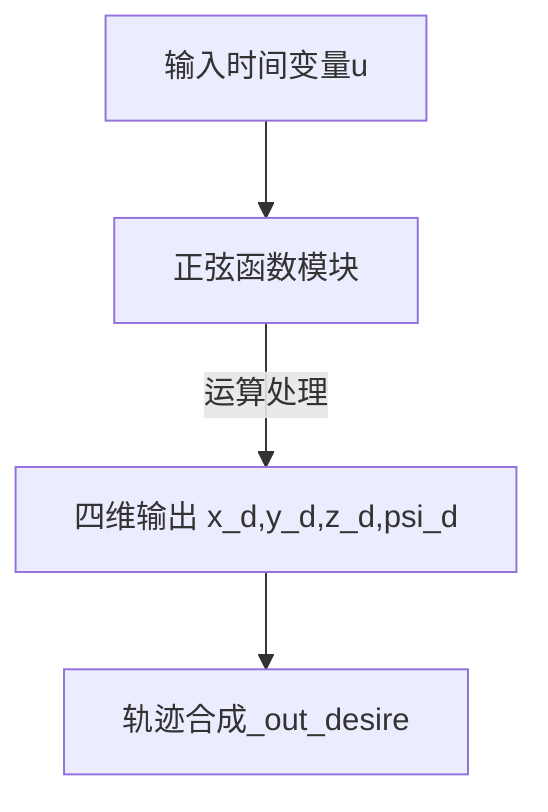
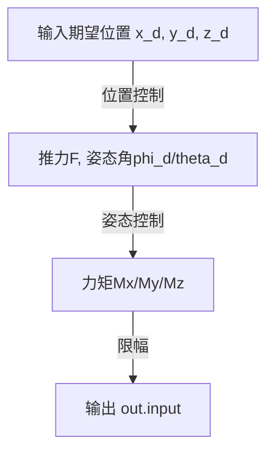
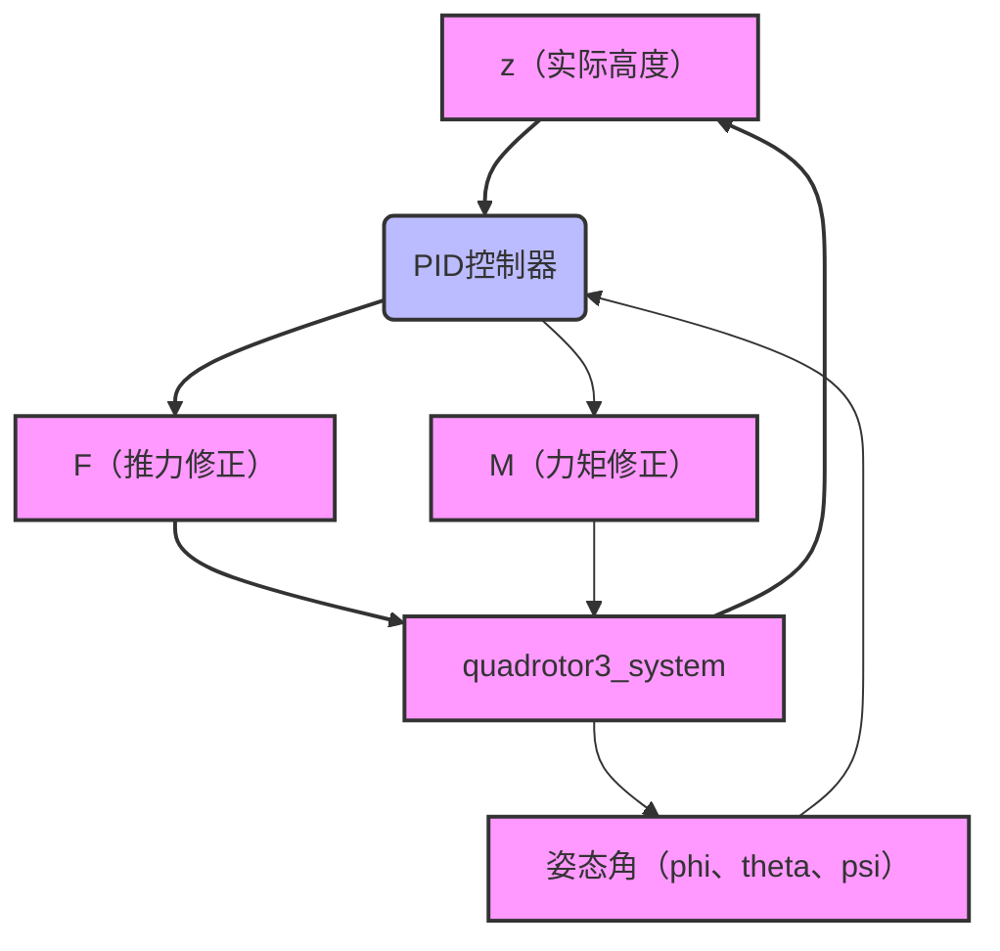

[TOC]

# 基于PID的四旋翼无人机轨迹跟踪控制

## 三维笔记说明

### 一、展示三维平面四旋翼8字形轨迹跟踪（以其为例）


---
### 二、状态方程解读

### 状态方程体系

### ​1、系统状态变量

$$
\mathbf{x} = \left\{
\begin{array}{ll}
    \text{位置:}       & x, y, z \\
    \text{线速度:}    & v_x, v_y, v_z \\
    \text{姿态角:}    & \phi, \theta, \psi \\
    \text{角速度:}    & \omega_\phi, \omega_\theta, \omega_\psi
\end{array}
\right\}, \quad
\mathbf{u} = \left\{
\begin{array}{ll}
    \text{力:}       & F_x, F_y, F_z \\
    \text{力矩:}     & M_\phi, M_\theta, M_\psi
\end{array}
\right\}
$$

-   ​**位置**: x,y,z
-   ​**线速度**: v~x~​,v~y~​,v~z~​
-   ​**姿态角（欧拉角）​**:  ψ（偏航角），ϕ（横滚角）, θ（俯仰角）
-   ​**角速度**: ω~ϕ~​ ω~θ~ ω~ψ​~
-   ​**控制输入**:
    -   F~x~​ F~y~​ F~z~​：x/y/z轴方向的控制力
    -   M~ϕ​~ M~θ~ ,M~ψ~​：绕各轴的力矩

----------

### ​**2、三维状态方程**

#### ​**1. 位置动力学**

$$
\begin{cases} 
\dot{x} = v_x \\ \\
\dot{y} = v_y \\ \\
\dot{z} = v_z 
\end{cases}
$$

#### **2. 线速度动力学**

由牛顿第二定律推导（含重力补偿）：

$$
\begin{cases} 
\dot{v}_x = \frac{F_x}{m} \\ \\
\dot{v}_y = \frac{F_y}{m} \\ \\
\dot{v}_z = \frac{F_z}{m} - g 
\end{cases}
$$

#### ​**3. 姿态角动力学**

姿态角变化率等于对应角速度：


$$
\begin{cases} 
\dot{ψ} = ω_ψ \\ \\
\dot{ϕ} = ω_ϕ \\ \\
\dot{θ} = ω_θ \\ 
\end{cases}
$$

#### ​**4. 角速度动力学**

由转动定律推导（转动惯量 J~x~​ J~y~ J~z~​）：


$$
\begin{cases} 
\dot{ω}_ϕ = -\frac{M_ϕ}{J_x} \\ \\
\dot{ω}_θ = -\frac{M_θ}{J_y} \\ \\
\dot{ω}_ψ = -\frac{M_ψ}{J_z}
\end{cases}
$$

---

### 三、轨迹生成


### 1、输入输出路径


---
### 2、核心模块详解

#### 1. 时间基准模块

-   ​**输入源**：左侧的`Clock(u)`模块代表时间变量，作为轨迹生成的基准参数
-   ​**参数设置**：默认时间变量u通过仿真时钟自动生成，对应Simulink仿真环境的时间轴

#### 2. 轨迹生成解析

-   ​**X轴轨迹(x_d)**：`4.5*sin(0.4*u)`

    -   振幅4.5米，角频率0.4 rad/s（周期约15.7秒）
    -   生成水平横向周期性正弦波动运动

-   ​**Y轴轨迹(y_d)**：`4.5*sin(0.2*u)`

    -   振幅4.5米，角频率0.2 rad/s（周期约31.4秒）
    -   ​与X轴形成2:1频率比，相位差为0°，生成“8字形”轨迹

-   ​**Z轴高度(z_d)**：`4.5*sin(0.4*u)-5.5`

    -   在基准高度-5.5米的基础上叠加振幅4.5米的正弦波动（角频率0.4 rad/s，与X轴同步）
    -   模拟无人机在垂直方向的周期性起伏

-   ​**偏航角(psi_d)**：`0`

    -  设定偏航角（Yaw角）为固定值0°，即无人机始终朝向初始方向飞行，无航向调整

- **输出模块（out.desire）​**

	-   ​**功能**：将 `x_d`、`y_d`、`z_d`、`psi_d` 四个信号封装为复合输出信号。
	-   ​**接口形式**：通常为`To Workspace`，供之后飞控系统（PID控制器）同步读取四自由度期望值。
---
### 四、PID控制器


###  1、 位置控制模块​

#### ​1. 输入信号​

-   ​**期望位置**​：`x_d`（X轴）、`y_d`（Y轴）、`z_d`（Z轴）及对应的**变化率**​（如 `dx_d/dt`、`dy_d/dt`、`dz_d/dt`）。
-   ​**物理意义**​：无人机在三维空间中的目标轨迹（8字形）

#### ​  2. 高度控制子模块​（Z轴）

-   ​**功能**​：独立控制Z轴高度（`z_d`），生成垂直方向推力 `F`。
-   ​**算法**​：通常为PID控制算法，计算高度误差（`error z = z_d - z_actual`）并调节推力。
-   ​**输出**​：推力 `F`（需满足电机推力约束，见后续限幅模块）。

#### （补充：高度控制子模块）


- **说明**：此处的QuadrotorState `From`模块由后续的三维四旋翼动态系统生成

#### ​​3. 水平位置控制（X/Y轴）​​

-   ​**功能**​：将X/Y轴的位置误差（`x_d - x_actual`、`y_d - y_actual`）经`theta phi 期望值计算`函数转换为期望姿态角（`phi_d` 滚转角、`theta_d` 俯仰角）。
-   ​**函数核心公式**​（简化版）：
    
    ```markdown
    phi_d ≈ (y_d - y_actual) * K_p  // 滚转角由Y轴误差生成
    theta_d ≈ (x_d - x_actual) * K_p // 俯仰角由X轴误差生成
    ```
    
-   ​**设计意图**​：通过调整无人机姿态倾斜产生水平推力分量，利用其实现水平位移位置跟踪。

----------

###  ​2、 姿态控制模块​

#### 1. 输入信号​

-   ​**期望姿态角**​：`phi_d`（滚转）、`theta_d`（俯仰）、`psi_d`（偏航）。
-   ​**当前姿态角**​：`phi`、`theta`、`psi`（来自传感器反馈）。

#### ​2. 姿态角误差计算

-   ​**功能**​：计算姿态角误差（如 `phi_d - phi`），驱动PID控制器生成力矩`M`
-   ​**算法**​：PID控制算法，抑制姿态振荡并快速跟踪期望角。

#### ​3. 力矩生成​

-   ​**输出力矩**​：`Mx`（滚转力矩）、`My`（俯仰力矩）、`Mz`（偏航力矩）。
-   ​**物理原理**​：
    -   `Mx` 和 `My`：通过差动调节前后/左右电机转速实现滚转和俯仰。
    -   `Mz`：通过调节对角电机转速差实现偏航（如电机1加速、电机3减速）。

----------

### ​ 3、限幅模块​

#### ​1. 推力限幅

-   ​**位置**​：位置控制模块（高度控制）输出端（推力 `F`）。
-   ​**作用**​：限制推力在电机物理极限范围内（ F_min ≤ F ≤ F_max）。
-   ​**参数示例**​：若电机最大升力为5N，则限幅为 `0~20N`（四电机总和）。

#### 2. 力矩限幅​

-   ​**位置**​：姿态控制模块输出端（力矩 `Mx`、`My`、`Mz`）。
-   ​**作用**​：确保力矩不超过电机扭矩和机臂结构强度限制。
-   ​**示例**​：`Mx_max` 由电机扭矩和机臂长度决定（公式：`M = F * L`）。

----------

### ​ 4、关键模块交互逻辑​

#### ​1. 数据流路径



-   ​**特点**​：内外环控制结构，外环位置控制环生成内环指令（推力与期望姿态），内环姿态控制环实现外环稳定与期望跟踪。

#### ​2. 模块协同作用*

-   ​**位置控制**​：解决“飞到哪里”的问题，依赖姿态控制实现水平位移。
-   ​**姿态控制**​：解决“如何稳定飞行”的问题，快速响应位置误差。
-   ​**限幅模块**​：确保控制指令符合物理可行性，防止电机饱和或结构损坏。

----------

### ​ 5、总结  核心设计思想​

#### ​1. 内外环控制架构

-   ​**优势**​：解耦位置与姿态控制，降低系统复杂度。
-   ​**典型应用**​：
    -   定高飞行时，`z_d`固定，`phi_d`/`theta_d`由轨迹生成器输入。
    -   轨迹跟踪时，`x_d`/`y_d`动态变化，位置控制实时解算姿态角需求。

#### ​​2. 姿态角生成逻辑

-   ​**X/Y轴位置误差→姿态角**​：通过调整滚转/俯仰角，将旋翼推力分解为水平力，实现平移运动。
-   ​**示例**​：若需向右移动（增大 `x_d`），位置控制增大 `theta_d`（俯仰角），无人机前倾，推力水平分量驱动右移。

#### ​3. 限幅的必要性​

-   ​**电机保护**​：防止指令超出电机最大转速或扭矩。
-   ​**稳定性保障**​：避免因指令突变导致姿态失稳或振荡。
---

### 五、三维四旋翼动态系统


###  1、 模型整体架构​

#### 1. 模型名称与层级结构​

-   ​**模型路径**​：`quadrotor3_8shape/三维四旋翼动态系统`
    -   ​**顶层模型**​：包含输入/输出接口、核心动力学模块（`quadrotor3_system`）及信号传递模块
    -   ​**子模块**​：包含四旋翼动力学方程、PID控制器、姿态解算、信号传递等细节

#### ​2. 主要模块分布​

-   ​**左侧输入**​：由PID控制器得到的输入信号 推力 `F` 和力矩 `M` 
-   ​**中央核心**​：`quadrotor3_system`（四旋翼动力学模型）。
-   ​**右侧输出**​：
    -   `QuadrotorState (send state)`：将无人机完整状态（位置、姿态、速度等）发送给PID控制器
    -   `state` 和 `out_state`：状态信号输出接口，用于数据记录与外部控制。

----------

### ​2、输入模块解析

#### ​​1. 推力输入 `F`​

-   ​**作用**​：输入四旋翼的总垂直推力，通常由高度控制模块经PID算法计算生成
-   ​**物理意义**​：控制无人机的升降运动（Z轴方向）
-   ​**信号流向**​：`F` → `quadrotor3_system` → 影响无人机垂直加速度

#### ​​2.  力矩输入 `M`​

-   ​**作用**​：输入三轴力矩（滚转、俯仰、偏航），通常由姿态环控制器生成
-   ​**物理意义**​：
    -   ​**滚转力矩（M_phi）​**​：控制无人机绕X轴旋转（左右倾斜）
    -   ​**俯仰力矩（M_theta）​**​：控制无人机绕Y轴旋转（前后倾斜）
    -   ​**偏航力矩（M_psi）​**​：控制无人机绕Z轴旋转（左右转向）
-   ​**信号流向**​：`力矩M` → `quadrotor3_system` → 影响无人机角加速度 → 姿态控制

----------

### ​3、核心模块 quadrotor3_system详解

#### ​1. 功能概述​

-   ​**动力学模型**​：基于牛顿-欧拉方程，模拟四旋翼的六自由度运动（3个平移自由度 + 3个旋转自由度）。其核心作用是将输入的`推力F​​`和`​力矩M`转换为无人机的运动状态，包括位置、速度、姿态角和角速度
-   ​**输入输出关系**​：
    -   ​**输入**​：推力 `F`、力矩 `M`。
    -   ​**输出**​：
        -   ​**位置**​：`x, y, z`（三维空间坐标）。
        -   ​**速度**​：`dx, dy, dz`（三轴线速度）。
        -   ​**姿态角**​：`phi`（滚转）、`theta`（俯仰）、`psi`（偏航）。
        -   ​**角速度**​：`p, q, r`（绕X/Y/Z轴的角速度）。

#### ​2. 内部逻辑

1.  ​**推力分配**​：将总推力 `F` 分配到四个电机
2.  ​**力矩计算**​：根据姿态期望与实际差生成三轴力矩 `M`
3.  ​**运动方程**​：
    -   ​**平移运动**​：`m * [dx; dy; dz] = [0; 0; F] - m * g * [0; 0; 1]`（考虑重力）
    -   ​**旋转运动**​：`I * [dp; dq; dr] = M - cross([p; q; r], I * [p; q; r])`（欧拉方程，`I` 为转动惯量矩阵）
4.  ​**姿态解算**​：通过角速度积分或四元数更新计算 `phi, theta, psi`
5. **坐标系转换​**：使用旋转矩阵（或四元数）将机体坐标系下的加速度转换到世界坐标系
----------

### ​4、输出模块解析

#### ​1. QuadrotorState (send state)​

-   ​**作用**​：输出无人机的完整状态信息，供其他子系统（如PID控制器、可视化模块）使用
-   ​**输出信号**​：
    -   ​**位置**​：`x, y, z`（包含世界坐标系数据）
    -   ​**姿态**​：`phi, theta, psi`（欧拉角形式）
    -   ​**速度**​：`dx, dy, dz`（线速度）和 `p, q, r`（角速度）

#### ​2. state 和 out_state​

-   ​**作用**​：将关键状态信号单独输出，用于实时监控或记录。
-   ​**典型用途**​：
    -   连接示波器观察动态响应。
    -   导出数据到MATLAB工作空间进行后处理。

----------

### ​5、 信号标签与连接逻辑​

#### ​1. 输入信号线​

-   ​**F**​：总推力输入，直接作用于四旋翼的垂直运动。
-   ​**M**​：三轴力矩输入，驱动无人机的滚转、俯仰、偏航运动。

#### ​​2. 输出信号线​

-   ​**x, y, z**​：无人机在三维空间中的位置坐标。
-   ​**dx, dy, dz**​：三轴线速度（位置的一阶导数）
-   ​**phi, theta, psi**​：滚转、俯仰、偏航角
-   ​**p, q, r**​：绕X/Y/Z轴的角速度（角度位置的一阶导数）

#### ​​3. 反馈回路​

-   ​**状态反馈**​：输出信号（如姿态角、位置）可能通过外部控制器（如PID模块）生成新的 `F` 和 `M`，形成闭环控制。
    
 


----------


### ​6、实际应用场景

1.  ​**悬停控制**​：通过PID调节 `F` 保持高度，调节 `M` 维持姿态稳定。
2.  ​**轨迹跟踪**​：给定 `x_d(t), y_d(t), z_d(t)`，通过位置-姿态耦合控制实现8字形三维路径跟踪。
3.  ​**抗风扰测试**​：注入外部力干扰，验证控制器的鲁棒性。

---
### 六、绘制三维四旋翼视觉跟踪代码实现


---
####  S代码解析

```matlab
function draw_quadrotor_3D_1(t, position, angle, orientation, traj)
% 输入参数：
% t: 时间 [n*1]
% position: 四旋翼三维位置坐标 [n*3，x,y,z]
% angle：四旋翼(phi, theta, psi)欧拉角 [n*3]
% orientation: 建模时z轴的正方向：值为1表示z轴向上; 值为0表示z轴向下
% traj: (x,y,z)参考轨迹 [n*3]

%% 坐标属性设置
fig = figure('Name','3D_Drone','Position',[500 250 650 400]);
ax = axes;
axis equal;
%%三维窗口更大（650×400），且使用axis equal保持三轴比例一致

if nargin < 4
fprintf(" 输入参数：\n\t t: 时间[n*1]\n\t position: 四旋翼(x,y,z)位置 [n*3]\n");
fprintf("\t angle：四旋翼(phi, theta, psi)欧拉角 [n*3]\n");
fprintf("\t orientation: 建模时z轴的正方向：值为1表示z轴向上; 值为0表示z轴向下(默认)\n");
fprintf("\t traj: (x,y,z)参考轨迹 [n*3]\n");
return;
end

if orientation == 1
position(:,2:3) = -position(:,2:3);
angle = -angle;
end
%%根据orientation调整坐标系方向

if nargin > 4
% 参考轨迹
plot3(ax,traj(:,1),traj(:,2),traj(:,3),'--k','LineWidth',2);
end

x_lim_min = floor(min(position(:,1))) - 2;
x_lim_max = ceil(max(position(:,1))) + 2;
y_lim_min = floor(min(position(:,2))) - 2;
y_lim_max = ceil(max(position(:,2))) + 2;
z_lim_min = floor(min(position(:,3))) - 2;
z_lim_max = ceil(max(position(:,3))) + 2;
set(ax,'looseinset',get(ax,'tightinset'),'View',[-37.5,15],'Nextplot','add','Xgrid','on','Ygrid','on','Zgrid','on',...
%%View: 设置三维视角（方位角 -37.5°，俯仰角 15°）
%%ZDir 和 YDir: 反转z轴和y轴方向，符合NED坐标系（z 向下为正）

'XLim',[x_lim_min x_lim_max],'YLim',[y_lim_min y_lim_max],'ZLim',[z_lim_min z_lim_max],...
'XTick',x_lim_min:1:x_lim_max,'YTick',y_lim_min:1:y_lim_max,'ZTick',z_lim_min:1:z_lim_max,...
'ZDir','Reverse','YDir','Reverse');
title(ax,'3D\_Quadrotor','Fontname', 'Times New Roman','FontSize',12);
xlabel(ax,'x(m)','Fontname', 'Times New Roman','FontSize',12);
ylabel(ax,'y(m)','Fontname', 'Times New Roman','FontSize',12);
zlabel(ax,'z(m)','Fontname', 'Times New Roman','FontSize',12);

% 实际轨迹属性
line = plot3(ax,0,0,0,'-r','LineWidth',2); % 画四旋翼三维运动轨迹
%% 四旋翼属性
ArmLength = 0.5;
quadrotor_body = ...
[ ArmLength, 0, 0, 1; ... % 1号电机
0, ArmLength, 0, 1; ... % 2号电机
-ArmLength, 0, 0, 1; ... % 3号电机
0, -ArmLength, 0, 1; ... % 4号电机
0, 0, 0, 1; ... % 中心位置
0, 0, -0.2, 1]'; % 类似于接收器的装备
%%定义了四旋翼在机体坐标系中的关键点（齐次坐标），包括四个电机、中心点和接收器

%% 画四旋翼结构
h1 = plot3(ax, 0, 0, 0, '-bo', 'MarkerSize', 6, 'LineWidth', 1, 'MarkerFaceColor','red', 'MarkerEdgeColor', 'red'); % x轴机臂和1、3号电机
h2 = plot3(ax, 0, 0, 0, '-bo', 'MarkerSize', 6, 'LineWidth', 1, 'MarkerFaceColor','blue', 'MarkerEdgeColor', 'blue'); % y轴机臂和2、4号电机
h3 = plot3(ax, 0, 0, 0, '-b', 'Linewidth', 2); % 天线
h4 = plot3(ax, 0, 0, 0, '.k', 'MarkerSize',10); % 把四旋翼位置投影到 xoy平面

% 电机周围圆圈
th = linspace(-pi,pi,20);
c1 = plot3(ax, 0, 0, 0, 'Color', [0 0 0]);
c2 = plot3(ax, 0, 0, 0, 'Color', [0 0 0]);
c3 = plot3(ax, 0, 0, 0, 'Color', [0 0 0]);
c4 = plot3(ax, 0, 0, 0, 'Color', [0 0 0]);

% 主循环：姿态变换与绘图
for i = 1:1:size(t,1)
quadrotor_pos = position(i,:)'; % 四旋翼在地球坐标系的位置 [x y z]
phi = angle(i,1); % 欧拉角 phi theta psi
theta = angle(i,2);
psi = angle(i,3);

%% 机体坐标系到地球坐标系的旋转变换
R = [cos(theta)*cos(psi) sin(phi)*sin(theta)*cos(psi)-cos(phi)*sin(psi) cos(phi)*sin(theta)*cos(psi)+sin(phi)*sin(psi);

cos(theta)*sin(psi) sin(phi)*sin(theta)*sin(psi)+cos(phi)*cos(psi) cos(phi)*sin(theta)*sin(psi)-sin(phi)*cos(psi);

-sin(theta) sin(phi)*cos(theta) cos(phi)*cos(theta)];
% 3D旋转矩阵（Z-Y-X顺序）

wHb = [R quadrotor_pos; 0 0 0 1]; 
% 定义一个增广矩阵(齐次变换矩阵)

quadrotor_world = wHb * quadrotor_body; % [4x4][4x6]
quadrotor_atti = quadrotor_world(1:3, :); 
% 坐标变换,得到四旋翼关键坐标点在地球坐标系的位置，用于画四旋翼真实姿态

%% 画四旋翼结构

% 电机和机架
set(h1,'Xdata',quadrotor_atti(1,[1 3]),'Ydata',quadrotor_atti(2,[1 3]),'Zdata',quadrotor_atti(3,[1 3])); % x轴机臂和1、3号电机

set(h2,'Xdata',quadrotor_atti(1,[2 4]),'Ydata',quadrotor_atti(2,[2 4]),'Zdata',quadrotor_atti(3,[2 4])); % y轴机臂和2、4号电机

set(h3,'Xdata',quadrotor_atti(1,[5 6]),'Ydata',quadrotor_atti(2,[5 6]),'Zdata',quadrotor_atti(3,[5 6])); % 天线

set(h4,'Xdata',quadrotor_atti(1,5),'Ydata',quadrotor_atti(2,5)); % xoy面投影

% 电机旁的圆圈

temp = R*(0.2*[sin(th);cos(th);0*th] + quadrotor_body(1:3,1)*ones(1,20)) + quadrotor_pos*ones(1,20);

set(c1,'Xdata',temp(1,:),'Ydata',temp(2,:),'Zdata',temp(3,:));

temp = R*(0.2*[sin(th);cos(th);0*th] + quadrotor_body(1:3,2)*ones(1,20)) + quadrotor_pos*ones(1,20);

set(c2,'Xdata',temp(1,:),'Ydata',temp(2,:),'Zdata',temp(3,:));

temp = R*(0.2*[sin(th);cos(th);0*th] + quadrotor_body(1:3,3)*ones(1,20)) + quadrotor_pos*ones(1,20);

set(c3,'Xdata',temp(1,:),'Ydata',temp(2,:),'Zdata',temp(3,:));

temp = R*(0.2*[sin(th);cos(th);0*th] + quadrotor_body(1:3,4)*ones(1,20)) + quadrotor_pos*ones(1,20);

set(c4,'Xdata',temp(1,:),'Ydata',temp(2,:),'Zdata',temp(3,:));

%% 运动轨迹
set(line,'Xdata',position(1:i,1),'Ydata',position(1:i,2),'Zdata',position(1:i,3)); % 画四旋翼运动轨迹
drawnow;
end
```

---
### 七、完整视频展⽰

<iframe src="//player.bilibili.com/player.html?isOutside=true&aid=114511948286065&bvid=BV1HiE1zcEJj&cid=29975577557&p=1" scrolling="no" border="0" frameborder="no" framespacing="0" allowfullscreen="true"></iframe>
<!--stackedit_data:
eyJoaXN0b3J5IjpbLTEzNzkxOTQ2NzcsMTk5MjExNTc0NSwtMz
I5NzI5NTQyLDk3NDg0Mzk2Myw2MDgzMzMzMzAsMTU4NDIzMzMw
MywtMTMzMDQ4NTUxMCwtNTMxOTc5MjI5LDEwNDM4NDMyNCwxMj
k2OTU3MTEwLDEyMTE5NzkwMTcsLTE1ODE1MjEyMzgsLTk5Mjk3
MzY3MCwzNTUwMDU0NTgsMTQ1ODQ3MzI5OCwtMjMxMzI1MzA1LD
g2ODMzMzE3OSwtOTA5NzY2NTMyLC0xOTU0OTI3NiwxMzkzNjc4
MDc0XX0=
-->