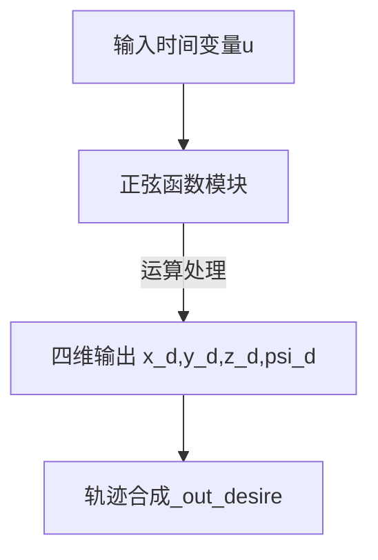
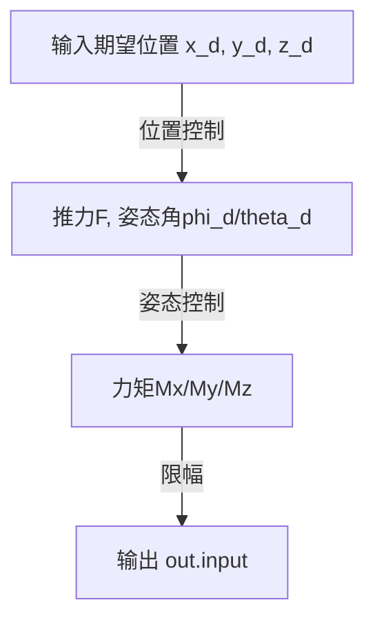

[TOC]

# 基于PID的四旋翼无人机轨迹跟踪控制

## 三维笔记说明

### 一、展示三维平面四旋翼8字形轨迹跟踪（以其为例）


### 二、状态方程解读

### 状态方程体系

### ​1、系统状态变量

$$
\mathbf{x} = \left\{
\begin{array}{ll}
    \text{位置:}       & x, y, z \\
    \text{线速度:}    & v_x, v_y, v_z \\
    \text{姿态角:}    & \phi, \theta, \psi \\
    \text{角速度:}    & \omega_\phi, \omega_\theta, \omega_\psi
\end{array}
\right\}, \quad
\mathbf{u} = \left\{
\begin{array}{ll}
    \text{力:}       & F_x, F_y, F_z \\
    \text{力矩:}     & M_\phi, M_\theta, M_\psi
\end{array}
\right\}
$$

-   ​**位置**: x,y,z
-   ​**线速度**: v~x~​,v~y~​,v~z~​
-   ​**姿态角（欧拉角）​**:  ψ（偏航角），ϕ（横滚角）, θ（俯仰角）
-   ​**角速度**: ω~ϕ~​ ω~θ~ ω~ψ​~
-   ​**控制输入**:
    -   F~x~​ F~y~​ F~z~​：x/y/z轴方向的控制力
    -   M~ϕ​~ M~θ~ ,M~ψ~​：绕各轴的力矩

----------

### ​**2、三维状态方程**

#### ​**1. 位置动力学**

$$
\begin{cases} 
\dot{x} = v_x \\ \\
\dot{y} = v_y \\ \\
\dot{z} = v_z 
\end{cases}
$$

#### **2. 线速度动力学**

由牛顿第二定律推导（含重力补偿）：

$$
\begin{cases} 
\dot{v}_x = \frac{F_x}{m} \\ \\
\dot{v}_y = \frac{F_y}{m} \\ \\
\dot{v}_z = \frac{F_z}{m} - g 
\end{cases}
$$

#### ​**3. 姿态角动力学**

姿态角变化率等于对应角速度：


$$
\begin{cases} 
\dot{ψ} = ω_ψ \\ \\
\dot{ϕ} = ω_ϕ \\ \\
\dot{θ} = ω_θ \\ 
\end{cases}
$$

#### ​**4. 角速度动力学**

由转动定律推导（转动惯量 J~x~​ J~y~ J~z~​）：


$$
\begin{cases} 
\dot{ω}_ϕ = -\frac{M_ϕ}{J_x} \\ \\
\dot{ω}_θ = -\frac{M_θ}{J_y} \\ \\
\dot{ω}_ψ = -\frac{M_ψ}{J_z}
\end{cases}
$$


### 三、轨迹生成


### 1、输入输出路径



### 2、核心模块详解

#### 1. 时间基准模块

-   ​**输入源**：左侧的`Clock(u)`模块代表时间变量，作为轨迹生成的基准参数
-   ​**参数设置**：默认时间变量u通过仿真时钟自动生成，对应Simulink仿真环境的时间轴

#### 2. 轨迹生成解析

-   ​**X轴轨迹(x_d)**：`4.5*sin(0.4*u)`

    -   振幅4.5米，角频率0.4 rad/s（周期约15.7秒）
    -   生成水平横向周期性正弦波动运动

-   ​**Y轴轨迹(y_d)**：`4.5*sin(0.2*u)`

    -   振幅4.5米，角频率0.2 rad/s（周期约31.4秒）
    -   ​与X轴形成2:1频率比，相位差为0°，生成“8字形”轨迹

-   ​**Z轴高度(z_d)**：`4.5*sin(0.4*u)-5.5`

    -   在基准高度-5.5米的基础上叠加振幅4.5米的正弦波动（角频率0.4 rad/s，与X轴同步）
    -   模拟无人机在垂直方向的周期性起伏

-   ​**偏航角(psi_d)**：`0`

    -  设定偏航角（Yaw角）为固定值0°，即无人机始终朝向初始方向飞行，无航向调整

- **输出模块（out.desire）​**

	-   ​**功能**：将 `x_d`、`y_d`、`z_d`、`psi_d` 四个信号封装为复合输出信号。
	-   ​**接口形式**：通常为`To Workspace`，供之后飞控系统（PID控制器）同步读取四自由度期望值。

### 四、PID控制器


### 1、 位置控制模块​

#### ​（1）输入信号​

-   ​**期望位置**​：`x_d`（X轴）、`y_d`（Y轴）、`z_d`（Z轴）及对应的**变化率**​（如 `dx_d/dt`、`dy_d/dt`、`dz_d/dt`）。
-   ​**物理意义**​：无人机在三维空间中的目标轨迹（8字形）

#### ​  (2）高度控制子模块​（Z轴）

-   ​**功能**​：独立控制Z轴高度（`z_d`），生成垂直方向推力 `F`。
-   ​**算法**​：通常为PID控制算法，计算高度误差（`error z = z_d - z_actual`）并调节推力。
-   ​**输出**​：推力 `F`（需满足电机推力约束，见后续限幅模块）。

#### ​​（3）水平位置控制（X/Y轴）​​

-   ​**功能**​：将X/Y轴的位置误差（`x_d - x_actual`、`y_d - y_actual`）经`theta phi 期望值计算`函数转换为期望姿态角（`phi_d` 滚转角、`theta_d` 俯仰角）。
-   ​**函数核心公式**​（简化版）：
    
    ```markdown
    phi_d ≈ (y_d - y_actual) * K_p  // 滚转角由Y轴误差生成
    theta_d ≈ (x_d - x_actual) * K_p // 俯仰角由X轴误差生成
    ```
    
-   ​**设计意图**​：通过调整无人机姿态倾斜产生水平推力分量，利用其实现水平位移位置跟踪。

----------

### ​2、 姿态控制模块​

#### ​**​（1）输入信号**​

-   ​**期望姿态角**​：`phi_d`（滚转）、`theta_d`（俯仰）、`psi_d`（偏航）。
-   ​**当前姿态角**​：`phi`、`theta`、`psi`（来自传感器反馈）。

#### ​**​（2）姿态角误差计算**​

-   ​**功能**​：计算姿态角误差（如 `phi_d - phi`），驱动PID控制器生成力矩`M`
-   ​**算法**​：PID控制算法，抑制姿态振荡并快速跟踪期望角。

#### ​**​（3）力矩生成**​

-   ​**输出力矩**​：`Mx`（滚转力矩）、`My`（俯仰力矩）、`Mz`（偏航力矩）。
-   ​**物理原理**​：
    -   `Mx` 和 `My`：通过差动调节前后/左右电机转速实现滚转和俯仰。
    -   `Mz`：通过调节对角电机转速差实现偏航（如电机1加速、电机3减速）。

----------

### ​**3. 限幅模块**​

#### ​**​（1）推力限幅**​

-   ​**位置**​：位置控制模块（高度控制）输出端（推力 `F`）。
-   ​**作用**​：限制推力在电机物理极限范围内（ F_min ≤ F ≤ F_max）。
-   ​**参数示例**​：若电机最大升力为5N，则限幅为 `0~20N`（四电机总和）。

#### ​**​（2）力矩限幅**​

-   ​**位置**​：姿态控制模块输出端（力矩 `Mx`、`My`、`Mz`）。
-   ​**作用**​：确保力矩不超过电机扭矩和机臂结构强度限制。
-   ​**示例**​：`Mx_max` 由电机扭矩和机臂长度决定（公式：`M = F * L`）。

----------

### ​**4. 关键模块交互逻辑**​

#### ​**​（1）数据流路径**​



-   ​**特点**​：内外环控制结构，外环位置控制环生成内环指令（推力与期望姿态），内环姿态控制环实现外环稳定与期望跟踪。

#### ​**​（2）模块协同作用**​

-   ​**位置控制**​：解决“飞到哪里”的问题，依赖姿态控制实现水平位移。
-   ​**姿态控制**​：解决“如何稳定飞行”的问题，快速响应位置误差。
-   ​**限幅模块**​：确保控制指令符合物理可行性，防止电机饱和或结构损坏。

----------

### ​**5. 核心设计思想**​

#### ​**​（1）分层控制架构**​

-   ​**优势**​：解耦位置与姿态控制，降低系统复杂度。
-   ​**典型应用**​：
    -   定高飞行时，`z_d`固定，`phi_d`/`theta_d`由遥控器或轨迹生成器输入。
    -   轨迹跟踪时，`x_d`/`y_d`动态变化，位置控制实时解算姿态角需求。

#### ​**​（2）姿态角生成逻辑**​

-   ​**X/Y轴位置误差→姿态角**​：通过调整滚转/俯仰角，将旋翼推力分解为水平力，实现平移运动。
-   ​**示例**​：若需向右移动（增大 `x_d`），位置控制增大 `theta_d`（俯仰角），无人机前倾，推力水平分量驱动右移。

#### ​**​（3）限幅的必要性**​

-   ​**电机保护**​：防止指令超出电机最大转速或扭矩。
-   ​**稳定性保障**​：避免因指令突变导致姿态失稳或振荡。

<!--stackedit_data:
eyJoaXN0b3J5IjpbMTIxMTk3OTAxNywtMTU4MTUyMTIzOCwtOT
kyOTczNjcwLDM1NTAwNTQ1OCwxNDU4NDczMjk4LC0yMzEzMjUz
MDUsODY4MzMzMTc5LC05MDk3NjY1MzIsLTE5NTQ5Mjc2LDEzOT
M2NzgwNzQsLTQxODc4OTAwMV19
-->