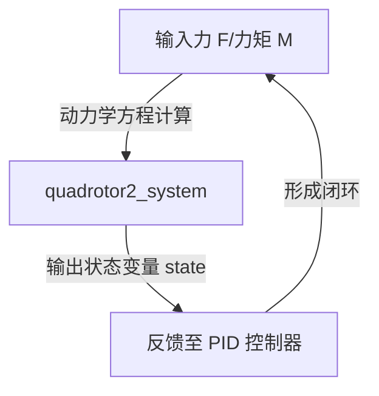
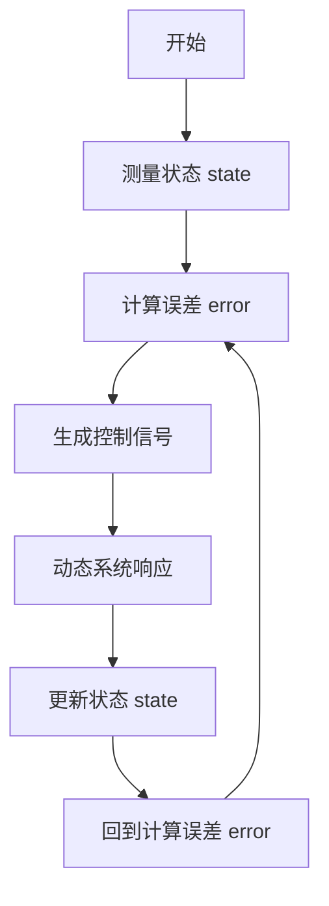

[TOC]
# 基于PID的四旋翼无人机轨迹跟踪控制

## 二维笔记说明

### 一、展示二维平面四旋翼圆形轨迹跟踪（以其为例）

---

### 二、状态方程解读

#### 状态方程体系

$$
\begin{aligned}
\dot{y} &= v_y \\
\dot{z} &= v_z \\
\dot{ϕ} &= \omega \\
\dot{v_y} &= \frac{F \sin \phi}{m} \\
\dot{v_z} &= \frac{F \cos \phi}{m} - g \\
\dot{ \omega} &= -\frac{1}{J} M \\
\end{aligned}
$$

1. **位置与速度关系**  
   - 物理意义：y方向位置变化率等于y方向速度  
   - 动力学层级：运动学方程  

2. **垂直方向位置与速度**  
   - 物理意义：z方向位置变化率等于z方向速度  
   - 动力学层级：运动学方程  

3. **俯仰角与角速度**  
   - 物理意义：俯仰角变化率等于角速度  
   - 动力学层级：运动学方程  

4. **y方向加速度**  
   - 物理意义：由推力的水平分量产生  
   - 关键参数：  
     - ( F )：旋翼总推力  
     - ( ϕ )：俯仰角  

5. **z方向加速度**  
   - 物理意义：由推力的垂直分量减去重力加速度  
   - 关键参数：
	   -  ( g )：重力加速度  (向下作用)
   - 动⼒学层级：平移动⼒学⽅程（含重⼒补偿）

6. **角加速度与力矩**  
   - 物理意义：角加速度由力矩驱动，
   - 关键参数：  
     - ( M )：力矩（控制输⼊）
     - (  J )：转动惯量  
	- 动⼒学层级：旋转动⼒学⽅程（⻆动量定理）
---

### 三、轨迹生成

1. ⼀般的轨迹都是以正弦波的形式来⽣成的，即为simulink⾥的`Sine Wave`模块⽣成，只需要`Sine Wave`正弦波模块、`Outpart`输出模块、`Mux`模块与`To Workspace`模块，较为简单。

如下图展⽰：
')
2. 也可以通过`Fcn`模块⾃⼰写函数式来定义轨迹的形状，较为推荐此⽅式来进⾏轨迹⽣成

### 讲解：

#### 核⼼模块解析

#### 1. 正弦信号源模块

- **模块1**：5*sin(u)
	- 功能：⽣成振幅为5、频率与输⼊`u`相关的正弦波信号。

	- 输出：通过连线连接到输出端⼝ Y （对应右侧的`y_fcn`信号线）。
- **模块2**：5 * sin(0.5 * u)
  - 功能：⽣成振幅为5、频率为 0.5*u 的正弦波（频率是模块1的⼀半）。

输出：通过连线连接到输出端⼝ Z （对应右侧的`z_fcn`信号线）。

#### 2. 输出端口

- Y和Z：将两个正弦信号输出到⼯作空间或外部设备，便于后续分析（可⽤`Scope`模块观测波形）。

')

---

### 四、PID控制器与二维四旋翼动态系统

### 讲解

### 1. 二维四旋翼动态系统

(1) **整体架构**
  
  - 模型名称：`quadrotor2_circle/二维四旋翼动态系统`  

  - 核心模块：  
    - `quadrotor2_system`：初始化定义⻜⾏器物理特性（质量m、转动惯量J），将输⼊的推⼒ F 和⼒矩 M 通过动⼒学⽅程转换为状态变量`state`

	- `state`：存储和传递状态变量（位置环中的y坐标、z坐标、姿态环的ϕ⻆度），形成闭环反馈回路。

	- `输⼊输出`：通过输⼊模块`力F`和`力矩M`驱动系统，输出⻜⾏器的实时状态（如位置、姿态）。

 (2)  关键参数与设计

- 信号流逻辑：



(3)  **技术含义**  

  - 状态反馈：实时数据驱动闭环控制。  
  

### 2. PID控制器设计

(1)  **整体架构**  

- 模型名称： quadrotor2_circle/PID控制器
实现⾼度（z/y⽅向）和横滚⻆（phi）的双闭环控制。

  - 核心模块：  
    - `PID`模块：包含两组PID控制器，分别为处理⾼度误差（`z_d - z`）的位置环与横向位置误差（`y_d - y`）及⻆度（`ϕ`)共同组成的姿态环
    - `限幅`模块：对输出推⼒`F`和⼒矩`M`进⾏约束
    - `加减法`模块：计算期望值与实际状态的误差（`error`信号）

(2) **关键参数与设计**

- 控制逻辑：

	- 输⼊：期望⾼度 z_d 、期望横向位置 y_d

	- 误差计算：通过减法模块⽣成`error`信号。

	- PID调节：将误差信号转换为控制量（`F`和`M`），并通过`限幅`模块防⽌超调。

	- 输出：控制量传递给动态系统模型驱动⻜⾏器。

- 抗饱和设计：`限幅`模块避免控制器输出超出电机能⼒范围。

(3) **技术含义**

- 双闭环控制：

	- 外环：位置控制（如⾼度z/y）⽣成⻆度期望值。

	- 内环：姿态控制（如横滚⻆ϕ）快速响应⻆度变化进⽽调整位置。

- 解耦设计：独⽴PID控制器处理不同⾃由度，简化多变量系统控制


### 3. 协同工作原理

(1) **信号闭环流程**  


(2) **⼯程实现⽬标**

- 使四旋翼⻜⾏器在⼆维空间内以圆形轨迹运动。

- 通过PID参数整定（如⽐例系数K、积分时间time）优化动态响应。

---

### 五、绘制二维四旋翼视觉跟踪代码实现


#### S代码解析

```matlab
function draw_quadrotor_2D(t, position, angle, traj)
%% %%定义函数 draw_quadrotor_2D，输入参数包括时间t、位置position、滚转角angle和参考轨迹traj

% 输入参数:
%   t: 时间序列 [n×1]
%   position: 二维位置坐标 [n×2]
%   angle: 滚转角 [n×1]
%   traj: 参考轨迹坐标 [n×2]

| 参数名 	| 数据类型	 | 物理意义												 |

| t 		| n×1向量	 | 时间序列 												 |

| position  | n×2矩阵    | 四旋翼二维位置坐标 (y, z) 								 |

| angle 	| n×1向量 	| 滚转角 φ（绕 x 轴旋转角度）								 |

| traj 		| n×2矩阵 	| 参考轨迹的 (y_ref, z_ref) 二维坐标 						 |

----------------------------------------------------------------------------------

%%% 坐标轴属性设置
fig = figure('Name', 'Quadrotor_2D', 'Position', [500 250 400 300]);
% 创建独立绘图窗口
ax = axes;
% 定义坐标轴
axis equal;
% 保持纵横比一致

%% 功能解析:
%% 创建一个独立的图形窗口，命名为 `Quadrotor_2D`，窗口位置为[500, 250]，大小为400×300
%% 定义坐标轴ax，并设置纵横比一致（axis equal），确保图形不变形。

----------------------------------------------------------------------
%%% 绘制参考轨迹
if nargin < 3
    fprintf("输入参数：\n\t t: 时间[n*1]\n\t position: (y, z)位置[n*2]\n\t angle: 角度[n*1]\n\t traj: (y, z)参考轨迹[n*2]\n");
    return;
end
%% 功能:若输入参数少于 3 个，直接返回。
%% nargin是MATLAB中用来获取函数输入参数个数的内置函数

if nargin > 3
    plot(ax, traj(:,1), traj(:,2), '-k', 'LineWidth', 2);
% 跟踪轨迹
end
%% 功能：若输入了参考轨迹traj，则在坐标轴ax上以黑色虚线绘制参考轨迹。

---------------------------------------------------------------
%% 动态调整坐标轴范围
y_lim_max = ceil(max(position(:,1))) + 2;
%% 取四旋翼在 y 轴方向的最大位置值，向上取整后加2，确保显示范围比实际数据最大值略大
%% 下方减号“-”同理
y_lim_min = floor(min(position(:,1))) - 2;
z_lim_max = ceil(max(position(:,2))) + 2;
z_lim_min = floor(min(position(:,2))) - 2;

set(ax, 'looseinset', get(ax, 'tightinset'), 'nextplot', 'add', ...'XGrid', 'on', 'YGrid', 'on',
%% “looseinset = get(ax, 'tightinset')”：消除坐标轴与图形窗口之间的多余空白
%% “nextplot = 'add'”：允许后续绘图（如轨迹线）叠加在当前坐标轴上，避免覆盖已有内容
%% “XGrid = 'on', YGrid = 'on'”：显示网格线

'Xlim',[y_lim_min y_lim_max],'Ylim',[z_lim_min z_lim_max],...
'XTick',y_lim_min:1:y_lim_max,'YTick',z_lim_min:1:z_lim_max);
%% “XTick = y_lim_min:1:y_lim_max“：将 y 轴刻度设为 1 米间隔，z轴同理

%% 坐标标签与标题美化
title(ax,'2D\_Quadrotor','Fontname', 'Times New Roman','FontSize',12);
%% 设置标题："2D_Quadrotor"，字体:'Times New Roman'并调整字号为12
xlabel(ax,'y(m)','interpreter','latex','Fontname', 'Times New Roman','FontSize', 12);
ylabel(ax,'z(m)','interpreter','latex','Fontname', 'Times New Roman','FontSize', 12);
%% 标注x轴与y轴名称为 y(m) 和 z(m)
----------------------------------------------------------------------
Quadrotor.L = 0.5;
% 机臂长度（左右对称）
Quadrotor.H = 0.2;
% 电机相对于机臂的高度
Quadrotor.W = 0.15;
% 螺旋桨半径
----------------------------------------------------------------------

%%% 定义构建四旋翼的关键坐标点（机体坐标系）

Quadrotor_Body = [Quadrotor.L 0 1;
-Quadrotor.L 0 1;
Quadrotor.L Quadrotor.H 1;
-Quadrotor.L Quadrotor.H 1;
Quadrotor.L+Quadrotor.W Quadrotor.H 1;
Quadrotor.L-Quadrotor.W Quadrotor.H 1;
-Quadrotor.L+Quadrotor.W Quadrotor.H 1;
-Quadrotor.L-Quadrotor.W Quadrotor.H 1 ]';
% 注意这里是转置

%% 1.功能：定义四旋翼在机体坐标系中的关键点（齐次坐标），包括：
◦ 机臂两端点：(±L, 0)。
◦ 电机顶部点：(±L, H)。
◦ 螺旋桨端点：(±L±W, H)。

%% 2.转置：矩阵转置为 3 行 8 列，便于后续齐次变换计算。
line = plot(ax,0,0,'-r','LineWidth',2);
% 四旋翼实际轨迹
h1 = plot(ax,0,0,'-b.','LineWidth',2,'MarkerSize',2); % 机臂
h2 = plot(ax,0,0,'-b','LineWidth',2); % 电机1
h3 = plot(ax,0,0,'-b','LineWidth',2); % 电机2
h4 = plot(ax,0,0,'-b','LineWidth',2); % 螺旋桨1
h5 = plot(ax,0,0,'-b','LineWidth',2); % 螺旋桨2
legend("参考轨迹","实际轨迹");
%% 功能：初始化绘图对象，包括：
◦ line: 红色实线绘制实际轨迹。
◦ h1-h5: 蓝色线段绘制机臂、电机和螺旋桨。
◦ 添加图例区分参考轨迹和实际轨迹。

----------------------------------------------------------------------
%% 主循环：逐帧更新四旋翼姿态

for i = 1:size(t)
% 获取当前四旋翼位置和姿态（当前状态state）
    quadrotor_pos = position(i,:)';
    phi = angle(i);
    % 2D旋转矩阵
    R = [cos(phi) sin(phi);
     -sin(phi) cos(phi)];
     % 通过把四旋翼在机体坐标系下的关键点变换到地球坐标系下
	% 用于画四旋翼在地球坐标系下的真实姿态
	%% 详细解析：该矩阵描述的是绕 x轴的旋转（在 y-z 平面内的投		影）。当phi为正时，四旋翼向右
1.齐次变换：通过齐次矩阵 “wHb” 将机体坐标系下的点变换到地球坐标系，结合旋转和平移操作。
2.动态绘制：使用 “drawnow” 强制刷新图形窗口，实现动画效果。
%% 齐次变换矩阵
    wHb = [R quadrotor_pos; 0 0 1]; 
    quadrotor_world = wHb * Quadrotor_Body;
	% [3x3][3x8]
	quadrotor_atti = quadrotor_world(1:2, :);
	%% 坐标变换
	
    % 四旋翼画图（更新图形对象数据）

set(h1,'Xdata',quadrotor_atti(1,[1 2]), 'Ydata',quadrotor_atti(2,[1 2]));
% 机臂
set(h2,'Xdata',quadrotor_atti(1,[1 3]), 'Ydata',quadrotor_atti(2,[1 3]));
% 左电机
set(h3,'Xdata',quadrotor_atti(1,[4 2]), 'Ydata',quadrotor_atti(2,[4 2]));
% 右电机
set(h4,'Xdata',quadrotor_atti(1,[5 6]), 'Ydata',quadrotor_atti(2,[5 6]));
% 左螺旋桨
set(h5,'Xdata',quadrotor_atti(1,[7 8]), 'Ydata',quadrotor_atti(2,[7 8]));
% 右螺旋桨
set(line,'Xdata',position(1:i,1),'Ydata',position(1:i,2));
% 四旋翼轨迹更新
drawnow;
end
end
%% 关键步骤:
1. 状态获取：提取当前时刻的位置 quadrotor_pos 和滚转角 phi。
2. 旋转矩阵计算：根据滚转角 phi 生成 2D 旋转矩阵 R，用于姿态变换。
3. 齐次变换矩阵：将旋转和平移组合为齐次变换矩阵`wHb`
4. 坐标变换：将机体坐标系下的关键点变换到地球坐标系。
5. 图形更新：通过`set`函数更新图形对象的坐标数据，动态绘制四旋翼姿态和轨迹。
```
### 六、完整视频展⽰


<!--stackedit_data:
eyJoaXN0b3J5IjpbLTEyMTQ5MDA1NTIsLTkxODg3MzAwNCwxMT
g4MjE5MzksLTQ2ODE0NTc4LC0xMDcyOTgxODM1LDY3ODUxMDY2
OSwtMTQ3ODMzMjE2NiwtMTUyNzQ1MDcwNiwxMTU0Njc5ODM3LC
00MjM2MzQ1NSwtNDgxNjQ4MjA3XX0=
-->